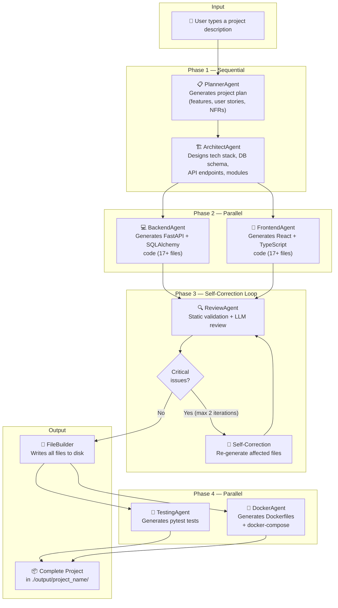
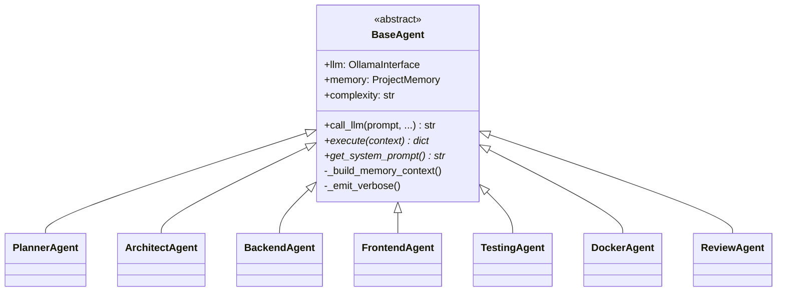
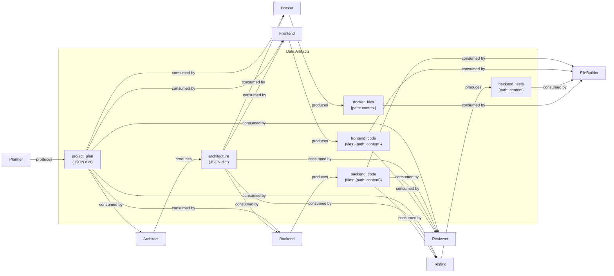
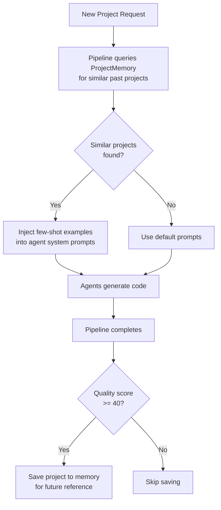
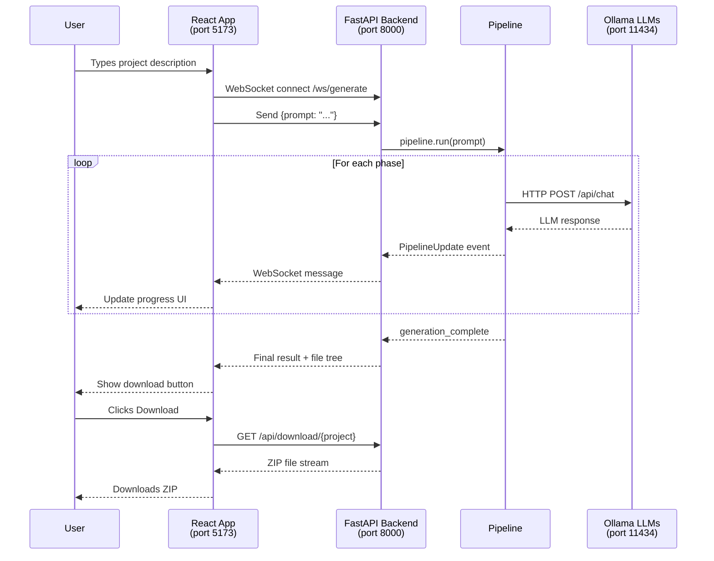

# 🤖 AI Software Company — Complete System Documentation

> **An autonomous multi-agent system that transforms a single English sentence into a full-stack web application (backend + frontend + tests + Docker) using local Ollama LLMs.**

---

## Table of Contents

1. [High-Level Overview](#1-high-level-overview)
2. [System Flow Diagrams](#2-system-flow-diagrams)
3. [Complete Directory Tree](#3-complete-directory-tree)
4. [Detailed File & Folder Reference](#4-detailed-file--folder-reference)
5. [Execution Modes & Frameworks](#5-execution-modes--frameworks)
6. [Agent Details](#6-agent-details)
7. [Memory System](#7-memory-system)
8. [Web UI Architecture](#8-web-ui-architecture)
9. [Data Flow Examples](#9-data-flow-examples)
10. [Configuration & Environment](#10-configuration--environment)
11. [Testing Strategy](#11-testing-strategy)
12. [Known Issues & Notes](#12-known-issues--notes)

---

## 1. High-Level Overview

This project is an **AI-powered software factory**. You describe what you want in plain language (e.g., *"Build a task manager with workspaces and user authentication"*) and the system:

1. **Plans** the project (features, user stories, priorities)
2. **Architects** the technical design (database schema, API endpoints, tech stack)
3. **Generates backend code** (FastAPI + SQLAlchemy + JWT auth)
4. **Generates frontend code** (React + TypeScript + Tailwind CSS)
5. **Reviews** the generated code for bugs and security issues
6. **Self-corrects** any critical issues found by the reviewer
7. **Writes tests** (pytest)
8. **Creates Docker configs** (Dockerfiles, docker-compose)
9. **Builds** all files to disk as a runnable project

All of this happens **locally** using Ollama LLMs — no cloud API keys required.

---

## 2. System Flow Diagrams

### 2.1 Main Pipeline Flow

This is the core execution pipeline that runs when you type `python main.py`:



### 2.2 Agent Inheritance Hierarchy



### 2.3 Data Flow Between Agents



### 2.4 Memory System Flow



---

## 3. Complete Directory Tree

```
multi-agent-swe/
│
├── .env                          # Active environment config (git-ignored)
├── .env.example                  # Template with all supported env vars
├── .gitignore                    # Git ignore rules
├── LICENSE                       # MIT License
├── requirements.txt              # Python dependencies for the system
│
├── main.py                       # ★ CLI entry point (Pipeline mode)
├── crew_main.py                  # ★ CLI entry point (CrewAI mode)
├── implementation_plan_6phases   # Historical design document
│
├── README.md                     # Project overview
├── QUICK_START.md                # Getting started guide
├── CONTRIBUTING.md               # Contribution guidelines
├── SUMMARY.md                    # Feature summary
├── ORGANIZATION_SUMMARY.md       # Code organization overview
├── PROJECT_STRUCTURE.md          # Directory structure overview
├── VERIFICATION.md               # System verification guide
├── SYSTEM_DOCUMENTATION.md       # ★ THIS FILE
│
├── agents/                       # ★ All AI agents
│   ├── __init__.py               #   Module exports
│   ├── base_agent.py             #   Abstract base class for all agents
│   ├── planner.py                #   Converts user prompt → project plan
│   ├── architect.py              #   Converts plan → architecture design
│   ├── backend.py                #   Generates FastAPI backend code
│   ├── frontend.py               #   Generates React frontend code
│   ├── testing.py                #   Generates pytest test suites
│   ├── docker.py                 #   Generates Docker deployment files
│   ├── reviewer.py               #   Reviews code quality + security
│   ├── crew_agents.py            #   CrewAI wrapper agents
│   └── templates/                #   (Reserved for future prompt templates)
│
├── builder/                      # ★ File output system
│   ├── __init__.py               #   Module exports
│   └── file_builder.py           #   Creates project directories & writes files
│
├── core/                         # ★ System core (config, orchestration)
│   ├── __init__.py               #   Module exports
│   ├── config.py                 #   Pydantic settings (loads .env)
│   ├── pipeline.py               #   ★ Main pipeline orchestrator
│   ├── crew_pipeline.py          #   CrewAI pipeline orchestrator
│   └── crew_tasks.py             #   CrewAI task definitions
│
├── memory/                       # ★ Long-term memory system
│   ├── __init__.py               #   Module exports
│   ├── project_memory.py         #   High-level memory API
│   ├── vector_store.py           #   ChromaDB / JSON vector store
│   ├── db/                       #   ChromaDB persistent storage
│   └── test_db/                  #   Test database storage
│
├── utils/                        # ★ Shared utilities
│   ├── __init__.py               #   Module exports
│   ├── ollama_interface.py       #   ★ LLM communication layer
│   ├── cache.py                  #   LRU response cache with TTL
│   ├── code_validator.py         #   Static analysis for generated code
│   └── token_manager.py          #   Dynamic token budget allocation
│
├── tools/                        # CrewAI agent tools
│   ├── file_tools.py             #   File reading tool for CrewAI
│   └── search_tools.py           #   DuckDuckGo search tool for CrewAI
│
├── scripts/                      # Utility scripts
│   ├── check_system.py           #   System health checker
│   ├── run_backend.bat           #   Windows batch: start UI backend
│   └── run_frontend.bat          #   Windows batch: start UI frontend
│
├── tests/                        # System tests
│   ├── __init__.py               #   Module marker
│   ├── README.md                 #   Testing guide
│   ├── test_setup.py             #   Environment validation
│   ├── test_agents_quick.py      #   ★ Quick offline agent tests
│   ├── test_planner.py           #   Planner agent test
│   ├── test_architect.py         #   Architect agent test
│   ├── test_backend_and_builder.py  Backend + builder test
│   ├── test_frontend.py          #   Frontend agent test
│   ├── test_reviewer.py          #   Reviewer agent test
│   ├── test_memory_smoke.py      #   Memory system smoke test
│   ├── test_full_system.py       #   ★ Full pipeline integration test
│   ├── test_full_workflow.py     #   End-to-end workflow test
│   ├── test_plan_output.json     #   Sample planner output fixture
│   └── test_architecture_output.json  Sample architect output fixture
│
├── ui/                           # ★ Web-based user interface
│   ├── README.md                 #   UI setup & usage guide
│   ├── start.bat                 #   Windows: start both servers
│   ├── start.sh                  #   Linux/Mac: start both servers
│   ├── backend/                  #   FastAPI WebSocket server
│   │   ├── app.py                #   ★ UI backend with WebSocket
│   │   ├── requirements.txt      #   UI-specific dependencies
│   │   ├── output/               #   Generated projects from UI
│   │   └── memory/               #   UI-specific memory storage
│   └── frontend/                 #   React + Vite SPA
│       ├── index.html            #   HTML entry point
│       ├── package.json          #   Node.js dependencies
│       ├── vite.config.ts        #   Vite configuration
│       ├── tsconfig.json         #   TypeScript configuration
│       ├── tailwind.config.js    #   Tailwind CSS configuration
│       └── src/
│           ├── main.tsx          #   React entry point
│           ├── App.tsx           #   ★ Main UI component (34KB)
│           └── index.css         #   Global styles
│
├── docs/                         # Extended documentation
│   ├── API_DOCUMENTATION.md      #   REST/WebSocket API reference
│   ├── ARCHITECTURE_VISUAL.md    #   Visual architecture diagrams
│   ├── CODEBASE_INDEX.md         #   File-by-file code index
│   ├── DEPLOYMENT_GUIDE.md       #   Production deployment guide
│   ├── OLLAMA_SETUP.md           #   Ollama installation & model setup
│   ├── PROJECT_PLAN.md           #   Development roadmap
│   ├── SUMMARY_AR.md             #   Arabic summary
│   └── USE_WEB_UI.md             #   Web UI user guide
│
├── output/                       # ★ Generated projects (CLI mode)
│   ├── *.json                    #   Saved plans & architectures
│   └── <project_name>/           #   Generated project directories
│
├── venv/                         # Python virtual environment
└── .venv-crewai/                 # Separate venv for CrewAI mode
```

---

## 4. Detailed File & Folder Reference

### 4.1 Root Files

| File | Purpose | Why It Exists |
|------|---------|---------------|
| `main.py` | **Primary CLI entry point.** Asks user for a project description, creates a `Pipeline`, runs it synchronously, displays real-time progress with emoji phases, and saves the plan/architecture JSON. | This is the main way to use the system from the command line. |
| `crew_main.py` | **Alternative CLI entry point** using CrewAI framework. Allows agents to communicate, delegate tasks, and use internet search tools via DuckDuckGo. | Provides a more advanced multi-agent collaboration mode with tool use. |
| `requirements.txt` | All Python dependencies: FastAPI, SQLAlchemy, Ollama HTTP clients, ChromaDB, CrewAI, pytest, etc. | Single source of truth for reproducible environment setup. |
| `.env` / `.env.example` | Environment variables. `.env` holds active config (model names, Ollama URL). `.env.example` is a template. | Allows users to customize LLM models and settings without editing code. |
| `implementation_plan_6phases` | Historical design document describing the 6-phase development plan for this system. | Preserved as project history and architectural context. |

---

### 4.2 `agents/` — The AI Workforce

Each agent inherits from `BaseAgent` and implements two methods: `get_system_prompt()` (instructions for the LLM) and `execute(context)` (the agent's logic).

| File | Class | LLM Model | Role |
|------|-------|-----------|------|
| `base_agent.py` | `BaseAgent` | — | Abstract parent. Provides `call_llm()` with memory injection, token budgeting, verbose logging, and retry. |
| `planner.py` | `PlannerAgent` | `qwen3.5:latest` | Transforms a user prompt into a structured project plan (JSON) with features, user stories, priorities, and acceptance criteria. Retries up to 3 times with self-correction if JSON parsing fails. |
| `architect.py` | `ArchitectAgent` | `gemma4:latest` | Takes the plan and designs the full system architecture: tech stack, database schema (tables, columns, relationships), API endpoints (CRUD for every resource), and deployment strategy. |
| `backend.py` | `BackendAgent` | `qwen2.5-coder:7b` | Generates a complete FastAPI backend: `main.py`, models, schemas, API routers, security (JWT + bcrypt), database config, and `requirements.txt`. Has a comprehensive fallback that generates 17 files without LLM. |
| `frontend.py` | `FrontendAgent` | `qwen2.5-coder:7b` | Generates a complete React + TypeScript + Tailwind frontend: `App.tsx`, page components (Login, Register, Dashboard), services, types, and config files. Fallback generates 17 files. |
| `testing.py` | `TestingAgent` | `qwen2.5-coder:7b` | Generates pytest test suites: `conftest.py` (fixtures, test DB), `test_auth.py` (registration, login, auth flows), `test_api.py` (CRUD operations, error cases). |
| `docker.py` | `DockerAgent` | `llama3.2:3b` | Generates Docker deployment files: backend Dockerfile (Python + uvicorn), frontend Dockerfile (Node + nginx), `docker-compose.yml`, `docker-compose.dev.yml`, nginx config, `.dockerignore`. |
| `reviewer.py` | `ReviewAgent` | `qwen2.5-coder:7b` | **Two-phase review**: (1) Static validation via `CodeValidator` (syntax, imports, placeholders, schema consistency), (2) Semantic LLM review (cross-file consistency, API contracts, security). Returns structured issues with fix instructions. |
| `crew_agents.py` | `SoftwareEngineeringCrewAgents` | — | Wraps the above agents as CrewAI `Agent` objects with tool access (internet search, file reading) for the alternative CrewAI execution mode. |

**Why each agent exists**: The pipeline needs specialized experts. A planner thinks differently from a coder. Separating concerns means each agent gets a focused system prompt optimized for its task, and different LLM models can be assigned to different roles (e.g., a cheaper/faster model for Docker configs, a larger model for code generation).

---

### 4.3 `core/` — Configuration & Orchestration

| File | Purpose | Why It Exists |
|------|---------|---------------|
| `config.py` | Uses `pydantic-settings` to load `.env` and expose typed settings: LLM models per agent, Ollama URL, output directory, log level. Singleton `settings` object. | Centralizes all configuration in one place. Changes to models/URLs require editing only `.env`. |
| `pipeline.py` | **★ The brain of the system.** Orchestrates agent execution with parallel support (`asyncio.gather` for Backend+Frontend and Testing+Docker). Implements the self-correction loop (review → fix → re-review, max 2 iterations). Handles memory save, file tree generation, and error recovery. | Without this, agents would just be independent functions. The Pipeline ensures correct execution order, parallel efficiency, and error handling. |
| `crew_pipeline.py` | CrewAI-specific pipeline that assembles agents and tasks into a sequential `Crew` and kicks off execution. | Alternative orchestration mode using CrewAI's built-in process management. |
| `crew_tasks.py` | Defines CrewAI `Task` objects (planning, architecture, coding, review) with descriptions and expected outputs. | CrewAI requires explicit task definitions separate from agents. |

---

### 4.4 `utils/` — Shared Infrastructure

| File | Purpose | Why It Exists |
|------|---------|---------------|
| `ollama_interface.py` | **★ The LLM communication layer.** Provides both async (`agenerate`) and sync (`generate`) methods. Includes: response caching, retry with exponential backoff (tenacity), streaming support, model routing per agent type. Singleton `ollama` instance. | Every agent needs to talk to the LLM. This centralizes HTTP communication, caching, and error handling so agents don't duplicate this logic. |
| `cache.py` | Thread-safe LRU cache with TTL. Keys are SHA-256 hashes of (model, prompt, system_prompt, temperature, json_mode). Tracks hit/miss statistics. | Avoids re-calling the LLM when the same prompt is sent again. Essential during development/testing when you re-run the same project description. |
| `token_manager.py` | Dynamically calculates `max_tokens` and `temperature` per agent type and project complexity. E.g., planner gets 2000 tokens (simple) to 4000 (complex); frontend gets 8000-16000. | Prevents token waste on simple tasks while giving complex code generation enough room. Without this, every agent would use a fixed 4000 tokens. |
| `code_validator.py` | Static analysis engine. Validates: Python syntax (AST parsing), import completeness (e.g., "uses `Depends()` but doesn't import it"), placeholder detection (`# TODO: implement`, `...`), SQLAlchemy model structure (`__tablename__`), schema consistency (architecture tables vs generated models), frontend structure. | Catches bugs before the LLM reviewer even sees the code. Static validation is fast, deterministic, and doesn't consume LLM tokens. |

---

### 4.5 `memory/` — Learning from Past Projects

| File | Purpose | Why It Exists |
|------|---------|---------------|
| `vector_store.py` | Dual-backend vector store: uses ChromaDB if installed, falls back to a pure-Python JSON store with manual cosine-similarity search. Includes `OllamaEmbedder` that calls Ollama's `/api/embed` endpoint. | The system needs to store and search project embeddings. ChromaDB is optional to keep the system runnable without heavy dependencies. |
| `project_memory.py` | High-level memory API. `save_project()` stores condensed project data (plan summary, architecture, code samples). `get_few_shot_examples()` retrieves similar past projects and formats them as system prompt additions per agent type. Quality threshold ensures only good projects are remembered. | Enables the system to learn from its past successes. Each run produces better results because agents receive examples from similar past projects. |
| `db/` | Persistent storage directory for ChromaDB data. | ChromaDB needs a directory to persist embeddings across restarts. |

---

### 4.6 `builder/` — File System Operations

| File | Purpose | Why It Exists |
|------|---------|---------------|
| `file_builder.py` | Takes generated code dictionaries (`{filepath: content}`) and writes them as real files on disk. Creates the full project directory structure (backend, frontend, docker dirs). Generates a `run.bat` for easy Windows startup and a comprehensive `README.md`. | Agents produce code as in-memory dictionaries. This module bridges the gap between generated data and an actual runnable project on disk. |

---

### 4.7 `tools/` — CrewAI Agent Tools

| File | Purpose | Why It Exists |
|------|---------|---------------|
| `file_tools.py` | CrewAI tool that allows agents to read file contents from disk. | In CrewAI mode, agents can inspect existing files (e.g., reviewer reading generated code). |
| `search_tools.py` | CrewAI tool wrapping DuckDuckGo search for internet research. | In CrewAI mode, the planner can search the web for best practices and competitor features before creating the project plan. |

---

### 4.8 `ui/` — Web User Interface

| Component | File | Purpose |
|-----------|------|---------|
| **Backend** | `ui/backend/app.py` | FastAPI server with WebSocket (`/ws/generate`) for real-time project generation. REST endpoints for file download (`/api/download/`), file content retrieval (`/api/file/`), health check (`/api/health`), and memory management (`/api/memory/stats`, `/api/memory/clear`). |
| **Frontend** | `ui/frontend/src/App.tsx` | Single-page React app (34KB). Provides a chat-like interface where users type project descriptions and watch agents work in real-time via WebSocket. Shows phase progress, verbose LLM logs, file tree, and download button. |
| **Startup** | `ui/start.bat` / `ui/start.sh` | Convenience scripts that start both backend (port 8000) and frontend (port 5173) servers simultaneously. |

**Why a Web UI?** The CLI works for developers, but a visual interface makes the system accessible to non-technical users and provides a much richer experience (real-time progress, file browsing, one-click download).

---

### 4.9 `tests/` — System Tests

| File | Tests What | Requires Ollama? |
|------|-----------|-------------------|
| `test_setup.py` | Configuration loading, Ollama connection, simple generation | ✅ Yes |
| `test_agents_quick.py` | All 6 agents (fallback mode), FileBuilder, import correctness | ❌ No |
| `test_planner.py` | PlannerAgent with live LLM | ✅ Yes |
| `test_architect.py` | ArchitectAgent with live LLM | ✅ Yes |
| `test_backend_and_builder.py` | BackendAgent + FileBuilder integration | ✅ Yes |
| `test_frontend.py` | FrontendAgent with live LLM | ✅ Yes |
| `test_reviewer.py` | ReviewAgent static + semantic review | ✅ Yes |
| `test_memory_smoke.py` | VectorStore and ProjectMemory operations | ❌ No (uses mock embeddings) |
| `test_full_system.py` | Complete pipeline: plan → architect → code → build | ✅ Yes |
| `test_full_workflow.py` | End-to-end workflow with memory integration | ✅ Yes |

**Important**: These tests are designed as standalone scripts (`python tests/test_agents_quick.py`), not as pytest-discoverable test functions. The `test_agents_quick.py` is the best offline test — it exercises every agent's fallback logic and the FileBuilder without needing Ollama.

---

### 4.10 `docs/` — Extended Documentation

| File | Content |
|------|---------|
| `API_DOCUMENTATION.md` | REST and WebSocket API reference for the UI backend |
| `ARCHITECTURE_VISUAL.md` | Visual diagrams of the system architecture |
| `CODEBASE_INDEX.md` | File-by-file index of the entire codebase |
| `DEPLOYMENT_GUIDE.md` | Production deployment instructions |
| `OLLAMA_SETUP.md` | How to install Ollama and download required models |
| `PROJECT_PLAN.md` | Development roadmap and future plans |
| `SUMMARY_AR.md` | Arabic language project summary |
| `USE_WEB_UI.md` | User guide for the web interface |

---

## 5. Execution Modes & Frameworks

### Mode 1: Pipeline Mode (Default) — `python main.py`

- Uses the custom `Pipeline` orchestrator in `core/pipeline.py`
- Parallel execution (Backend + Frontend run concurrently)
- Self-correction loop (ReviewAgent → fix → re-review)
- Memory integration (learns from past projects)
- Response caching (avoids duplicate LLM calls)
- Dynamic token budgeting per agent

### Mode 2: CrewAI Mode — `python crew_main.py`

- Uses the CrewAI framework for agent orchestration
- Agents can delegate tasks to each other
- Internet search capability (DuckDuckGo)
- File reading capability
- Sequential process (no parallel execution)
- Requires `crewai` package (separate venv recommended)

### Mode 3: LangGraph Mode (Upcoming/Alternative)

- Uses LangGraph for highly controllable, stateful, and cyclical agent workflows
- Advanced node-based execution graph for complex multi-agent interactions
- Full support for state management, loops, and human-in-the-loop interventions
- Leverages `langgraph` and `langchain-ollama`
- Ideal for complex tasks requiring explicit verification steps before proceeding


---

## 6. Agent Details

### 6.1 How an Agent Call Works

```
User Request
    ↓
Pipeline calls agent.execute(context)
    ↓
Agent builds a specific prompt from context
    ↓
agent.call_llm(prompt)
    ↓
BaseAgent checks memory for few-shot examples
    ↓
TokenManager calculates optimal max_tokens + temperature
    ↓
OllamaInterface sends HTTP POST to Ollama /api/chat
    ↓
Response is cached (SHA-256 key)
    ↓
Agent parses JSON response, validates, returns result
```

### 6.2 Model Assignments (from `.env`)

| Agent | Default Model | Why This Model |
|-------|--------------|----------------|
| Planner | `qwen3.5:latest` | Good at structured planning and creative thinking |
| Architect | `gemma4:latest` | Excellent at producing consistent JSON schemas |
| Backend | `qwen2.5-coder:7b` | Specialized code generation model |
| Frontend | `qwen2.5-coder:7b` | Same coder model, good with TypeScript/React |
| Testing | `qwen2.5-coder:7b` | Code-aware for test generation |
| Docker | `llama3.2:3b` | Lightweight model sufficient for config files |
| Reviewer | `qwen2.5-coder:7b` | Needs code understanding for review |
| Debugger | `llama3.1:8b` | General reasoning for bug identification |

---

## 7. Memory System

The memory system gives the AI agents a form of **long-term learning**:

1. **After each successful generation**, the pipeline stores a condensed version of the project (plan summary, architecture, code samples, quality score) as a vector embedding.

2. **Before each new generation**, agents query memory for similar past projects. If found, relevant examples are injected into the system prompt as **few-shot examples**.

3. **Quality gating**: Only projects with quality score ≥ 40 are saved. Quality is calculated from: review pass (+40), no errors (+30), files generated (up to +30).

4. **Dual backend**: Works with ChromaDB for production-quality vector search, or falls back to a simple JSON file with pure-Python cosine similarity if ChromaDB isn't installed.

---

## 8. Web UI Architecture



---

## 9. Data Flow Examples

### 9.1 What the Planner Produces

```json
{
  "project_name": "TaskMaster",
  "description": "A task management application with user authentication and workspaces",
  "features": [
    {"name": "User Authentication", "priority": "high", "complexity": "medium"},
    {"name": "Task CRUD", "priority": "high", "complexity": "simple"},
    {"name": "Workspace Management", "priority": "medium", "complexity": "complex"}
  ],
  "user_stories": [
    {
      "as_a": "Registered User",
      "i_want": "create a new workspace",
      "so_that": "I can organize my tasks by project",
      "acceptance_criteria": ["Given I am logged in, when I click 'New Workspace', then a workspace is created"]
    }
  ]
}
```

### 9.2 What the Architect Produces

```json
{
  "tech_stack": {
    "backend": {"framework": "FastAPI", "orm": "SQLAlchemy 2.0"},
    "frontend": {"framework": "React 18", "language": "TypeScript"},
    "database": {"primary": "SQLite"}
  },
  "database_schema": {
    "tables": [
      {"name": "users", "columns": [{"name": "id", "type": "INTEGER"}, {"name": "email", "type": "VARCHAR"}]},
      {"name": "workspaces", "columns": [{"name": "id"}, {"name": "name"}, {"name": "owner_id"}]}
    ]
  },
  "api_design": {
    "endpoints": [
      {"path": "/auth/register", "method": "POST"},
      {"path": "/workspaces/", "method": "GET"},
      {"path": "/tasks/", "method": "POST"}
    ]
  }
}
```

### 9.3 What the Backend Agent Produces

A dictionary like `{"files": {"app/main.py": "from fastapi import...", "app/models/user.py": "class User(Base):..."}}` — containing 17+ complete Python files.

---

## 10. Configuration & Environment

### Key `.env` Variables

| Variable | Default | Description |
|----------|---------|-------------|
| `OLLAMA_BASE_URL` | `http://localhost:11434` | Ollama server address |
| `PLANNER_MODEL` | `qwen3.5:latest` | LLM model for planning |
| `ARCHITECT_MODEL` | `gemma4:latest` | LLM model for architecture |
| `BACKEND_MODEL` | `qwen2.5-coder:7b` | LLM model for backend code |
| `FRONTEND_MODEL` | `qwen2.5-coder:7b` | LLM model for frontend code |
| `EMBEDDINGS_MODEL` | `bge-m3:latest` | Model for vector embeddings |
| `OUTPUT_DIR` | `./output` | Where generated projects are saved |
| `LOG_LEVEL` | `INFO` | Logging verbosity |

---

## 11. Testing Strategy

### Quick Verification (No Ollama Required)

```bash
python scripts/check_system.py        # Syntax + import + flow check
python tests/test_agents_quick.py     # All agents (fallback mode)
```

### Full Integration Test (Requires Ollama)

```bash
python tests/test_full_system.py      # Complete pipeline test
```

### System Health Check Results (Latest Run)

```
=== SYNTAX CHECK ===    12/12 files OK
=== IMPORT CHECK ===    All agents + config + builder OK
=== PIPELINE FLOW ===   All 6 agents correctly mapped to models
=== REQUIREMENTS ===    All 7 core packages installed
=== AGENT TESTS ===     ALL 6 TESTS PASSED (4,149 files generated)
```

---

## 12. Known Issues & Notes

1. **Pytest discovery hangs**: The test files in `tests/` are standalone scripts, not pytest-compatible test functions. Run them directly with `python tests/<file>.py` instead of `pytest tests/`.

2. **CrewAI & LangGraph compatibility**: The `crewai>=0.28.8` and `langgraph>=0.0.26` versions specified in `requirements.txt` might not be fully compatible with bleeding-edge Python versions (like Python 3.14). Use a separate virtual environment (`.venv-crewai`) with Python 3.11-3.12 for these advanced multi-agent framework modes.

3. **`.env.example` vs actual `.env`**: The `.env.example` contains legacy cloud API key placeholders (OpenAI, Anthropic, AWS). These are **not used** — the system runs entirely on local Ollama LLMs. The actual `.env` file contains only Ollama-relevant settings.

4. **Memory system**: Requires Ollama's embedding model (`bge-m3:latest`) to be pulled. If the model isn't available, memory gracefully degrades to disabled (agents still work, just without few-shot examples).

5. **`agents/templates/`**: Currently empty. Reserved for future externalized prompt templates.

---

*Last updated: 2026-06-06 | Generated by comprehensive system audit*
