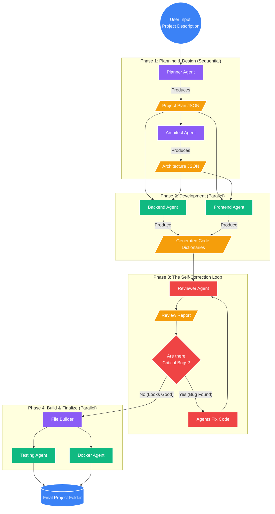
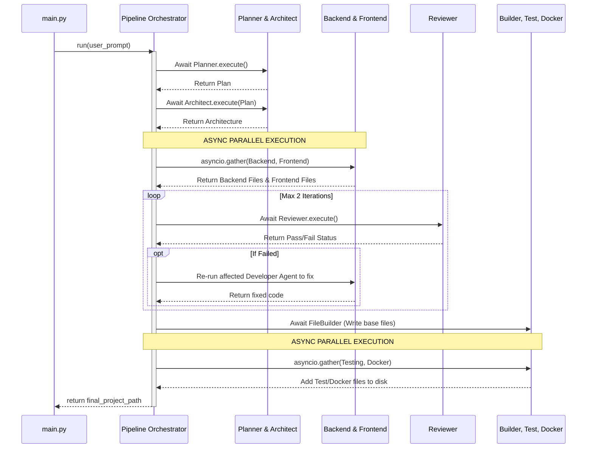
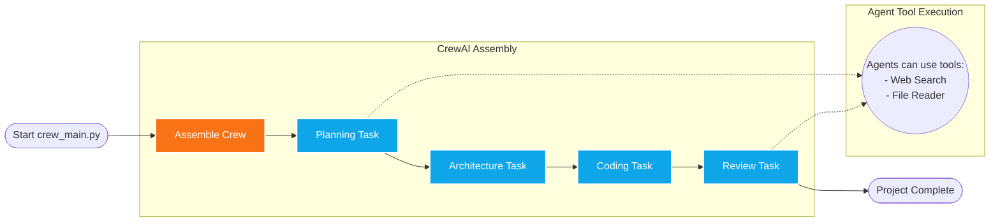
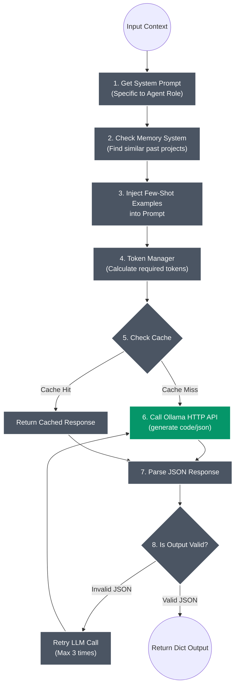
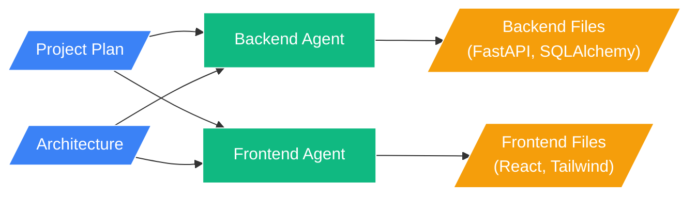
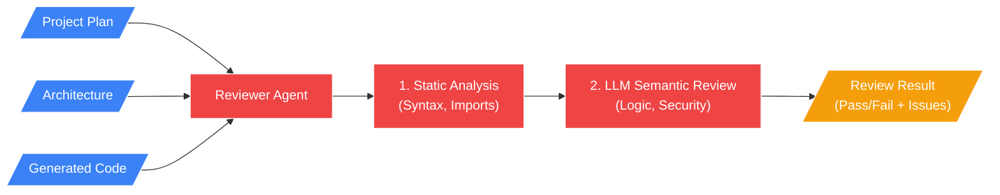
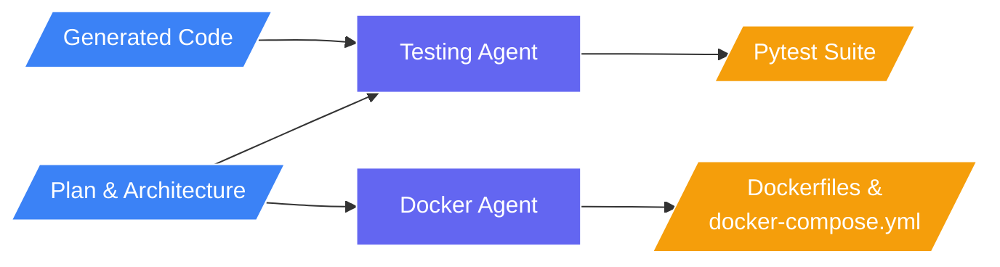

# Pipeline Flow Diagrams

This document contains Mermaid diagrams illustrating exactly how the project's pipelines and agents work.

### 1. The Whole Pipeline (Overall System Flow)
This diagram shows the complete journey from the moment a user enters a prompt to the moment the final application is built.

### 2. The Custom Pipeline (From `core/pipeline.py`)
This shows exactly how the Python code in `pipeline.py` orchestrates the agents using `asyncio` for parallel processing.

### 3. The CrewAI Pipeline (From `core/crew_pipeline.py`)
This shows how the alternative CrewAI mode works. It is sequential and task-based.

### 4. The Internal Processing Loop for EVERY Agent
Because all agents inherit from `BaseAgent`, they all share this identical internal "thinking" loop when processing their specific tasks.

---

### 5. Specific Input/Output Flows for Each Agent Role
This section breaks down exactly what data each specific agent takes in and what it produces.

#### Planner & Architect (Phase 1)

#### Code Generators (Phase 2)

#### Reviewer (Phase 3)

#### DevOps & Finalization (Phase 4)

